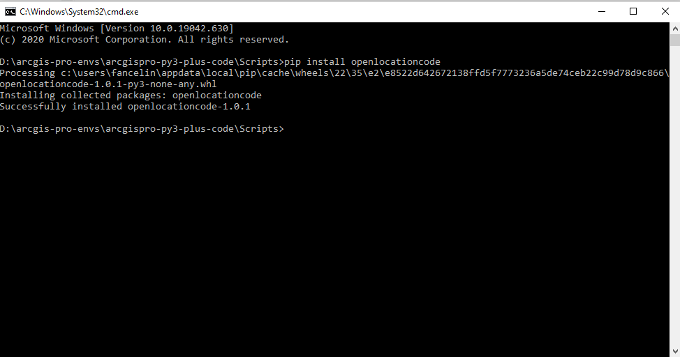

# ArcGIS Pro Plus Code Generator

# Description

This tool exposes the open location code API create by google and uses it to generate Plus Codes on ArcGIS feature classes. The API documentation is there: https://github.com/google/open-location-code

Detailed information about Plus Codes and the KML Service that Google Provides can be found there: https://grid.plus.codes/

This tool is a side effect of a project I have done for work. I have explored different solutions with FME and QGIS, but this was by far the fastest solution. It can generate plus code on points, and polygon feature classes.

# System Requirements

This tool is developed and tested for ArcGIS Pro. I have tested for ArcGIS Pro 2.7. Your python environment must be of 3.x (tested with 3.7, but I assume it works with 3.6 too). 

The open location code library for Python must be installed in your python environment. The next section will explain how to do that.

# How to install

## Clone your Python Environment

Open ArcGIS Pro, and bring up the menu. That will let you access your Python options, and create a new Python environment. We need that since we need to install the open location code API, and that won't be allowed in ArcGIS Pro's default environment.
 - Open ArcGIS Pro
 - Open the menu on the left ribbon
 - Go to the Python section of the menu.
 - Click on manage environment
 - Clone your default environment. Give it a meaningful name and location. In my case, I am storing my custom ArcGIS Pro environment on `D:\arcgis-pro-envs`. The name of my environment is : `arcgispro-py3-plus-code`

Once cloning is over, select your new environment as your default environment when you want to use our tool. You will need to restart ArcGIS Pro.

## Install the open location code API

Open a command line prompt, and use the `cd` command to navigate in the subdirectory of your newly created environment. In my case: `D:\arcgis-pro-envs\arcgispro-py3-plus-code\Scripts`. Then run the following command line:

`pip install openlocationcode`. 

Once it is done, the command line should look like that.

For more instructions about the open location code API, go to: https://github.com/google/open-location-code/tree/master/python

# Creating a folder connection to the tool:

Create a folder connection, as per the screenshot below, and navigate where you have downloaded and extracted the tool.

You will then be able to access the tool

# How to use

Use the tool box in ArcGIS Pro. There is built-in help in the tool metadata, and the tool is configured to guide you and minimize input errors.

In order to use the tool, double click on the tool `Get Plus Code`

The tool with then guide you through the list of parameters to provide:

# How to contribute

If you want to help, or have any suggestion, log an issue, and a pull request if you feel bold enough. Just remember to be nice.

# Data Considerations

Your input feature class must be using Lat / Long, on the spheroid WGS84. The wkid associated with that spatial reference system is 4326. The tool will send you a friendly error message otherwise.

The tool expects a field to populate in your input feature class. That field must be of type string. Its length must be longer than the number of characters request for the plus length + 1. This is because Plus Code will add an extra character '+' after the 8th character. The minimum field length must be 9. This is because even if you ask for a Plus Code encoded on 4 characters, the API still returns 9 characters: for example `86JW0000+`. I have not figured out if that's good or bad yet. 

